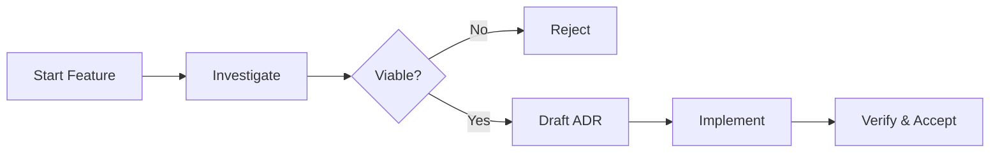

# 🤖 AI-Native Development Template

[](LICENSE)
[](https://anthropic.com)

> **A standardized, agentic workflow for modern software engineering.**
> This template configures Claude Code with specialized agents and slash commands to streamline the entire software development lifecycle—from architectural decision-making to high-performance coding.

---

## 🚀 The "Feature-First" Workflow

We enforce a rigorous yet efficient development loop that prioritizes **thinking before coding**.



### 1. Exploration 🧭
Start by creating a dedicated feature space. This encourages isolated experimentation. Often I find it helpful and beneficial to do multiple investigations and designs before formalizing a plan. The low level details will stay in the investigation documents while the higher level functional requirements and archtectural elements will be formalized in the ADR.
- **`/fn-feature {name}`**: Scaffolds a new feature folder with a readiness checklist.
- **`/fn-investigation {feature} {topic}`**: Creates a structured document to explore specific technical approaches.

### 2. Decision Making ⚖️
Once investigations yield a clear path, formalize it using Architecture Decision Records (ADRs).
- **`/fn-adr {feature}`**: Synthesizes successful investigations into a **Proposed** ADR.
- **`/fn-reject {feature} {topic}`**: Formally rejects an investigation path with rationale (crucial for future context).

### 3. Implementation & Iteration 🛠️
This is where the actual coding happens.
- **`/fn-task {feature} {adr}`**: The primary engine for implementation. It reads the ADR, breaks it down into sub-tasks, and iterates until the requirements are met.
- **Delegate**: Use the specialized agents (see below) through the task command to implement the ADR requirements.

### 4. Finalization ✅
- **`/fn-review`**: Technical PR review focused on logic, bugs, and style. It filters false positives and auto-fixes critical items.
- **`/wa-review`**: High-level architectural audit based on the Well-Architected Framework.
- **`/fn-document`**: Triggers the `@documentation-agent` to update project documentation.
- **`/fn-accept {feature} {adr}`**: Moves the implemented ADR to the permanent record and marks the feature as complete.

---

## 🧠 Specialized Agents

Your team of expert sub-agents, each optimized for specific lifecycle phases.

| Agent | Role | Best For | Model |
|-------|------|----------|-------|
| **`@adr-analyzer`** | 📐 **Architect** | Parsing ADRs, creating task lists, and verifying implementation compliance. | Sonnet |
| **`@coding-agent`** | 🔨 **Engineer** | Standard feature implementation, refactoring, and multi-file changes. | Sonnet |
| **`@complex-coding-agent`** | 🧠 **Sr. Engineer** | High-complexity architecture, race conditions, and system design. | Opus |
| **`@fast-coding-agent`** | ⚡ **Junior Dev** | Single-file edits, quick fixes, test updates. Fast and cheap. | Haiku |
| **`@well-architected-agent`** | 🛡️ **Auditor** | Reviews code against Reliability, Security, Cost, Ops, and Performance pillars. | Sonnet |
| **`@documentation-agent`** | 📝 **Tech Writer** | Updating docs, fixing typos, and ensuring documentation builds. | Sonnet |

---

## ⚡ Slash Commands

Quick shortcuts to drive the workflow.

### Architecture & Feature Management
| Command | Description |
|---------|-------------|
| `/fn-feature` | **Init**: Create a new feature folder structure. |
| `/fn-investigation` | **Explore**: Add a new investigation topic to a feature. |
| `/fn-reject` | **Decide**: Mark an investigation as rejected (with reasons). |
| `/fn-adr` | **Propose**: Generate an ADR from viable investigations. |
| `/fn-task` | **Implement**: Execute and iterate on an ADR's requirements. |
| `/fn-review` | **PR Review**: Technical review of logic, bugs, and style fixes. |
| `/fn-document` | **Docs**: Update documentation to reflect recent changes. |
| `/fn-accept` | **Finalize**: Promote an ADR to accepted status and move to `docs/adr`. |

### Well-Architected Reviews
| Command | Focus Area |
|---------|------------|
| `/wa-review` | **Audit**: Comprehensive architectural review across 5 pillars. |
| `/wa-security` | **Security**: Deep dive into vulnerabilities and auth patterns. |
| `/wa-reliability` | **Reliability**: Check resilience, error handling, and recovery. |
| `/wa-performance` | **Performance**: Analyze scalability, latency, and resource usage. |

---

## 🛠️ Usage

### Starting a New Feature
```bash
> /fn-feature bulk-data-export
> /fn-investigation bulk-data-export stream-serialization
> # ... research ...
> /fn-adr bulk-data-export
```

### Running Reviews
```bash
# Architectural Audit
> /wa-review

# Technical PR Review
> /fn-review
```

### Intelligent Coding
Don't just ask to "fix code." Delegate to the right expert, this is often fast and saves tokens:
```bash
# Complex refactor or bug fixes (Opus)
> @complex-coding-agent Refactor the connection pooling logic to prevent deadlocks.

# Most coding work (Sonnet)
> @fast-coding-agent Add a null check to the User parser.

# Simple fix (Haiku)
> @fast-coding-agent Add a null check to the User parser.
```

---

## 📂 Project Structure

```text
.
├── .claude/
│   ├── agents/         # Agent definitions
│   └── commands/       # Slash command documentation
├── docs/
│   ├── adr/            # Accepted Architecture Decision Records
│   └── features/       # Active feature development folders
└── src/                # Source code
```

## Also see

- [Architecture Decision Records (ADRs)](https://learn.microsoft.com/en-us/azure/well-architected/architect-role/architecture-decision-record)
- [Azure Well-Architected Framework](https://learn.microsoft.com/en-us/azure/well-architected/)
- [Github Spec-Kit](https://github.com/github/spec-kit/blob/main/spec-driven.md) is a slighter heavier alternative and works with more coding agents